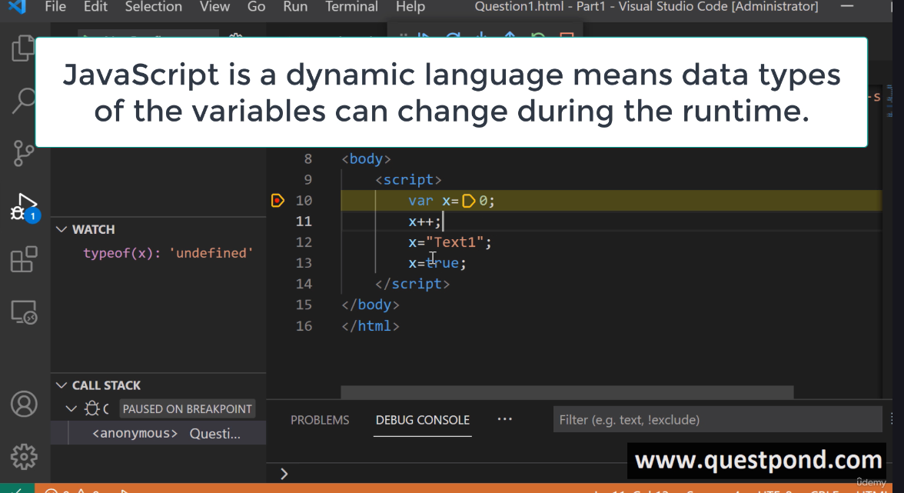
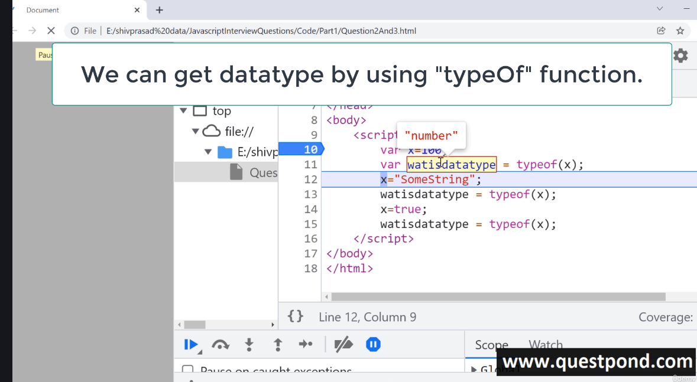
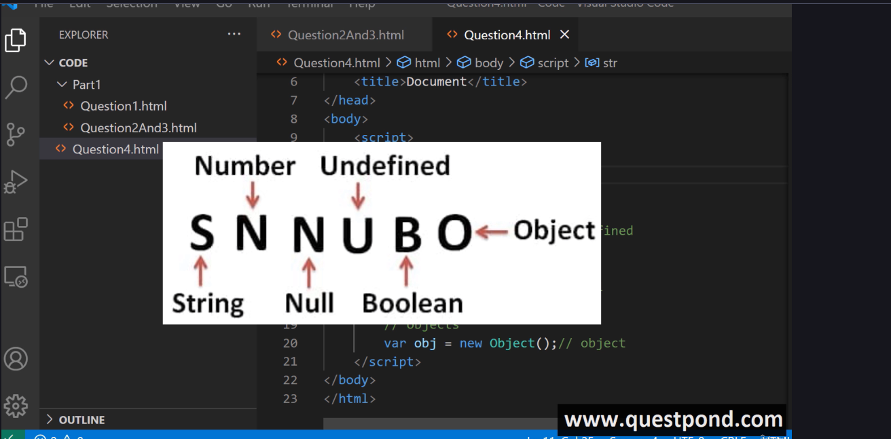
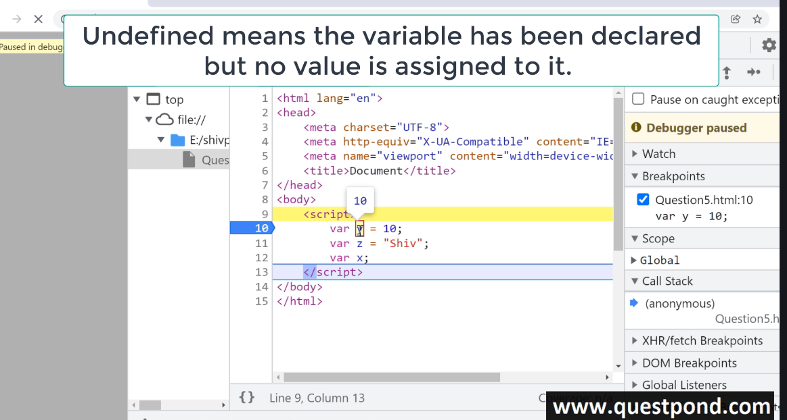
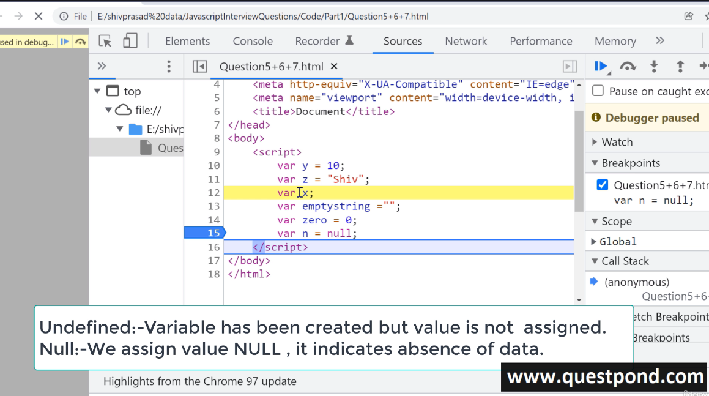
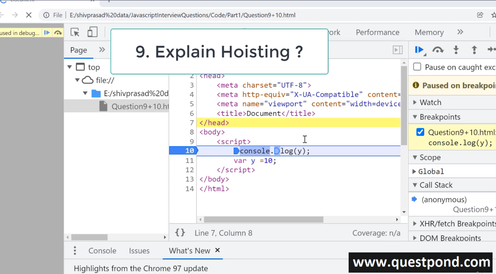
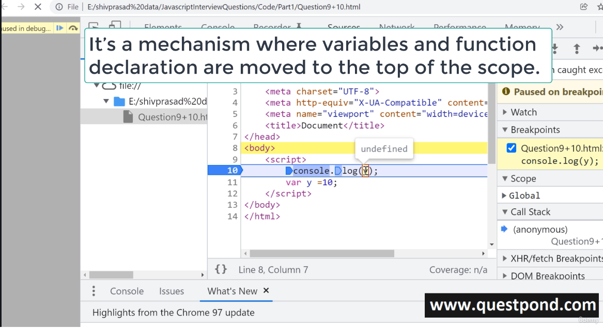
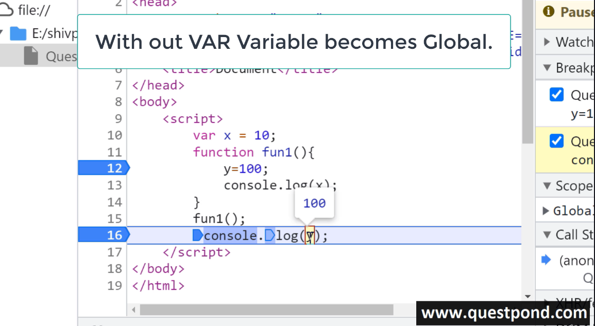
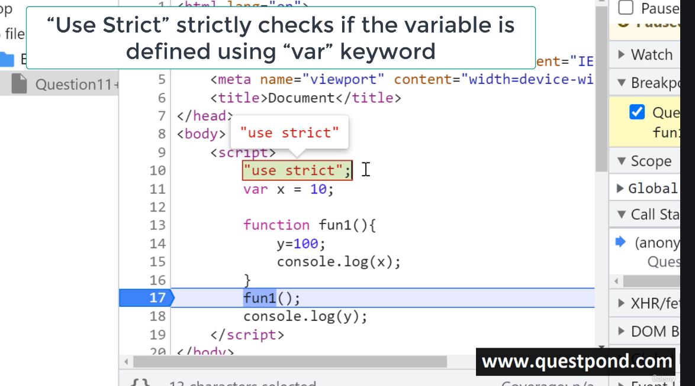

<<<<<<< HEAD
JavaScript is a dynamic language meaning data type of the variables can change during the runtime



How to get datatype by using typeOf function



What are different Data Types in JS

Primitive and Objects


Primitive: String, number, null, undefined, boole, big int, symbol

non-primitive:

array, Function, Objects


Undefined


```
  var x =10;
  var n; // it is declared but nut assigned value is undefined
  var n ; // variable has been created but not assigned value

```



Explaing JavaScript Hoisting?


It's a mechanism where variables and function, declaration are moved to the top of the scope before code executes

```
 console.log(y)
 var y = 10
```


11. what are global variables?
Global variavles are accessivle through out the webpage or the document

```
var x = 10;
function fun1() {
console.log("x", x);
}
fun1();

```
12. What are the issues with Global variables
it will make hard to debug the code

variable with out var key word becomes global



=======
JavaScript is a dynamic language meaning data type of the variables can change during the runtime

>>>>>>> 6dcbe59c7a3db2d18685f0fa5b007df7d94aa69e
